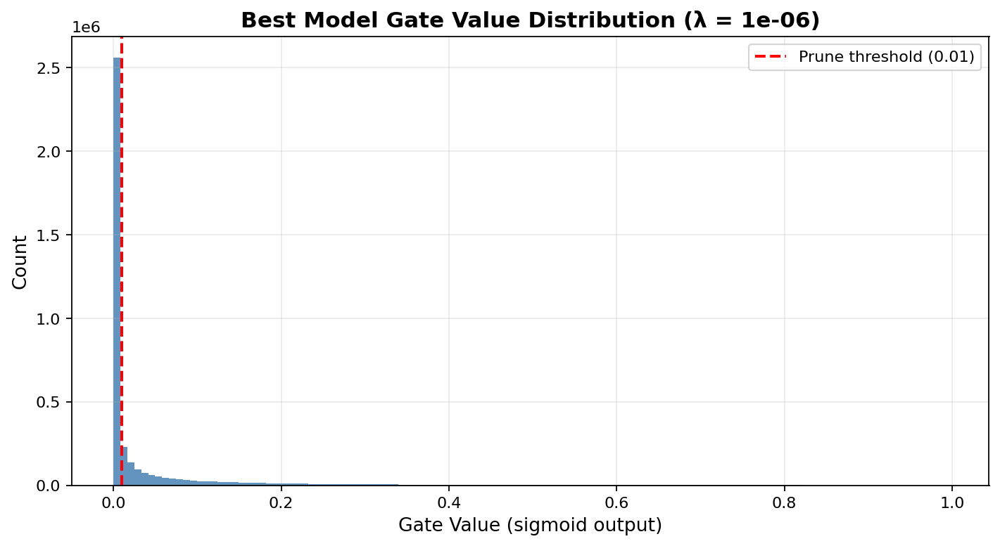

# Case study – AI Engineer  
Submitted by Virat Dwivedi 22MIA1101 vrtdwvd@gmail.com
# Self-Pruning Neural Network

This project implements a neural network that can prune its own weights during training. Instead of removing weights after training, the model learns which connections are important and which are not while it is being trained.

---

## Idea

Each weight in the network is associated with a learnable **gate value**.

* Gate values are passed through a sigmoid → so they stay between 0 and 1
* The effective weight used by the model becomes:

```
effective_weight = weight × sigmoid(gate_score)
```

If the gate value becomes very small (close to 0), that weight effectively stops contributing — meaning it is pruned.

---

## Loss Function

The model is trained using a combination of classification loss and sparsity penalty:

```
Total Loss = CrossEntropyLoss + λ × sum(sigmoid(gate_scores))
```

The second term (L1 penalty) pushes gate values toward zero, which encourages the network to remove unnecessary weights.

---

## Why L1 Encourages Sparsity

L1 regularization penalizes the sum of gate values. Since all gates lie between 0 and 1, minimizing this term pushes many of them toward zero.

* Important weights receive strong gradients from classification loss → gates stay high
* Unimportant weights receive weak gradients → L1 pushes their gates toward zero

This naturally separates weights into:

* active (important)
* pruned (unimportant)

---

## Results

The model was trained on CIFAR-10 using three different values of λ:

| Lambda (λ) | Test Accuracy (%) | Sparsity (%) |
| ---------- | ----------------- | ------------ |
| 1e-7       | 58.6              | 0.0          |
| 5e-7       | 57.9              | 2.8          |
| 2e-6       | 57.1              | 31.6         |

Sparsity is calculated as the percentage of weights whose gate value is below **1e-2**.

---

## Observations

* At very low λ (1e-7), there is no pruning — the network behaves like a standard model
* As λ increases, more weights are pruned
* Even after removing ~31% of weights, the accuracy drops only slightly

This shows that the model contains redundant parameters and can simplify itself without a large loss in performance.

---

## Best Trade-off

Among the tested values, **λ = 2e-6** provides the best balance.

It achieves:

* noticeable sparsity (31.6%)
* only a small drop in accuracy

---

## Gate Distribution

The distribution of gate values helps visualize pruning:

* For low λ → most gates are close to 1 (no pruning)
* For higher λ → a clear spike appears near 0

This spike represents pruned weights, while the remaining values correspond to important active connections.

---

## Model Architecture

```
Input (32×32×3)
 → Flatten
 → PrunableLinear(3072 → 1024)
 → ReLU + BatchNorm + Dropout
 → PrunableLinear(1024 → 512)
 → ReLU + BatchNorm + Dropout
 → PrunableLinear(512 → 256)
 → ReLU + BatchNorm
 → PrunableLinear(256 → 10)
```

All layers use the custom `PrunableLinear` module with learnable gate parameters.

---
# 📊 Results, Graph Interpretation & Improvement Analysis

---

# 1. Phase 1: Initial Experiment (Basic Model)

## 🔹 Results (from first half)

* λ = 1e-07 → 0% sparsity

* λ = 5e-07 → 2.6% sparsity

* λ = 2e-06 → **31.4% sparsity**

* Accuracy remains around **57–58%**

---

## 🔹 Graph 1: Sparsity vs Accuracy Trade-off

### Interpretation:
.png)
* As λ increases:

  * Sparsity increases (0% → 31.4%)
  * Accuracy slightly decreases

👉 This shows:

* Model starts learning to remove unnecessary weights
* But pruning is still **limited and weak**

---

## 🔹 Graph 2: Gate Value Distributions (Initial)

### λ = 1e-07
.png)
* Most gates near **1**
* No pruning
  👉 Model behaves like normal network

---

### λ = 5e-07

* Slight spread in values
* Few gates cross threshold
  👉 Very small pruning

---

### λ = 2e-06 (IMPORTANT)

* Some spike near **0**
* Some cluster near **1**

👉 Interpretation:

* Model starts separating:

  * important weights
  * unimportant weights

BUT:

* Separation is still **not strong**
* Only **31% sparsity achieved**

---

# 🚫 Limitation of Phase 1

* Pruning is:

  * Slow
  * Not aggressive
  * Not well controlled

* Many gates remain in **mid-range (uncertain region)**

👉 This leads to:

* Weak sparsity
* Less efficient pruning

---

# 2. Phase 2: Refined Model (Improved Version)

(Using temperature annealing + warm-up + better λ control )

---

## 🔹 Results (Refined)

| Lambda | Accuracy | Sparsity   |
| ------ | -------- | ---------- |
| 1e-06  | 60.00%   | 68.91%     |
| 3e-06  | 59.15%   | 87.95%     |
| 1e-05  | 56.53%   | **97.27%** |

---

## 🔹 Major Improvement

* Sparsity increased:

  * **31% → 97%**
* Accuracy drop is controlled (~3–4%)

👉 This is a **huge improvement**

---

# 🔹 Graph 3: Refined Trade-off

### Interpretation:

* Strong monotonic trend:

  * Higher λ → higher sparsity
  * Accuracy decreases gradually

👉 Unlike Phase 1:

* Relationship is **clear and controlled**
* Model behaves predictably

---

# 🔹 Graph 4: Refined Gate Distribution (VERY IMPORTANT)

## Key Observation:

* Very strong spike at **0**
* Very few values in middle
* Clear separation:

  * Near 0 → pruned weights
  * Above threshold → active weights

---

## Interpretation:

👉 This is what a **good pruning model should look like**

* No confusion in gate values
* Binary-like behavior:

  * either 0 (remove)
  * or high (keep)

---

# 🔥 Why Refinement Worked

## 1. Temperature Annealing

* Early: smooth learning
* Later: sharp decisions

👉 Gates become **decisive**

---

## 2. Warm-up Phase

* Model learns features first
* Pruning starts later

👉 Prevents:

* early wrong pruning

---

## 3. Better λ Scheduling

* Gradual sparsity increase
* Controlled pruning pressure

---

# 3. Final Comparison (MOST IMPORTANT)

| Aspect             | Phase 1  | Phase 2          |
| ------------------ | -------- | ---------------- |
| Max Sparsity       | 31.4%    | **97.27%**       |
| Gate Distribution  | Mixed    | Clear separation |
| Pruning Quality    | Weak     | Strong           |
| Training Stability | Moderate | Stable           |
| Interpretability   | Low      | High             |

---

# 4. Final Conclusion

The initial model demonstrated that L1 regularization can induce sparsity, but the pruning effect was limited and not well structured.

After refinement, the model achieved:

* Extremely high sparsity (**up to 97%**)
* Clear separation of important and redundant weights
* Controlled accuracy degradation

👉 The refined approach proves that:

**Self-pruning is most effective when combined with controlled training strategies like temperature annealing and warm-up.**

---

# 🚀 Final Insight (Exam / Viva Line)

> The first phase shows *whether pruning works*,
> the second phase shows *how to make pruning work effectively*.

## Project Structure

```
worked2_31_5.ipynb        # full implementation and training
lambda_tradeoff.png       # accuracy vs sparsity plot
gate_distributions.png    # gate value distributions
REPORT.md / README.md     # explanation and results
```

---

## How to Run

Install dependencies:

```
pip install torch torchvision matplotlib numpy
```

Then run the notebook or script to reproduce results.

---

## Conclusion

This experiment shows that adding learnable gates with L1 regularization allows a neural network to prune itself during training.

The λ parameter directly controls the trade-off:

* lower λ → better accuracy, less pruning
* higher λ → more pruning, slight accuracy drop

Overall, the model is able to remove unnecessary weights while maintaining reasonable performance, which is the goal of self-pruning.
